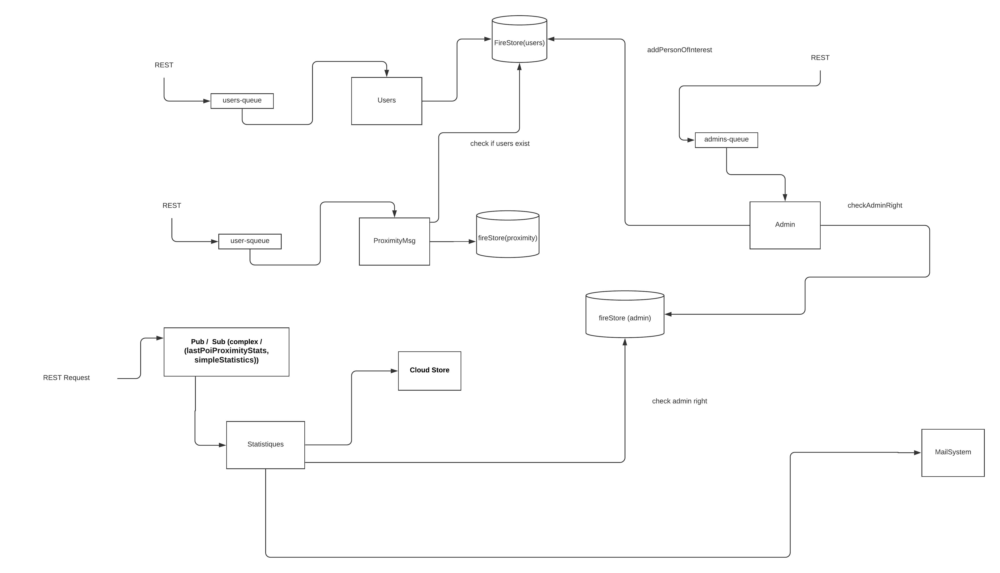
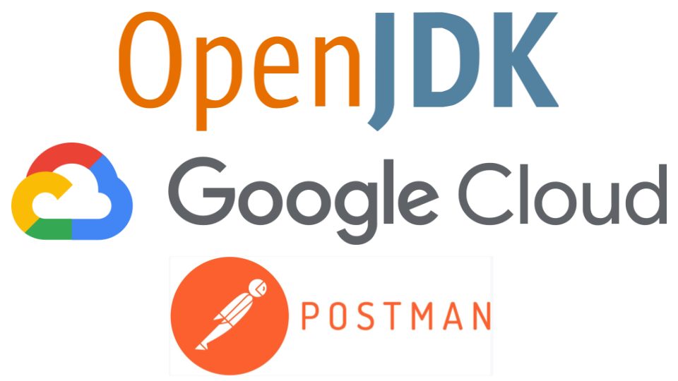

# sacc-quarantine
* Auteurs: **Team sacc-quarantine**
    * AINADOU Florian
    * DJEKINOU Paul-Marie
    * KOFFI Paul
    * NABAGOU Djotiham
  
# Vue d'ensemble
 Cette étude de cas est utilisée pour illustrer les différentes technologies impliquées dans le cours d'Architecture Orienté Services (SOA) donné à Polytech Nice - Sophia Antipolis en 5e année. Ce code de démonstration nécessite les logiciels suivants pour fonctionner correctement :
 
   * Environnement de cloud computing : Google Cloud Platform - AppEngine
   * Langage d'implémentation : Java 8
   
   
  ## Vision du produit
  Le produit à mettre en oeuvre est décrit 👉 [ici](https://docs.google.com/document/d/1QFXZAhFMRabdx4F0zQ0NKs9t1-L6cKcxWnoYvnVYcUc/edit#heading=h.jeqxggd4uam1).
    
  L'architecture logicielle à développer dans ce projet se présente comme suit :
  <p align="center">
      
  </p>
  
 ## Compte rendu du projet
 Le compte rendu du projet se trouve 👉 [ici](https://docs.google.com/document/d/1zPnzFt1AAtaH-RedQ0Z2q4z4xp3GpVwdAaoLgQ_mo2s/edit?usp=sharing)  
 
 
 ## Spécificités des services utilisés
 * Cloud Storage : le nom du bucket utilisé est bucket_quarantine
 * Mailing : Pour l'envoi de mail, nous avons utilisé une api mail appelée **mailjet** qui fonctionne avec AppEngine. Les mails sont ainsi reçus dans l'onglet **Promotions** de sa boîte de réception Gmail.
 
 ## Comment utiliser ce repository
  * La branche `master` (la branche par défaut) représente la dernière version stable du système.
  * La branche `develop` représente le système en cours de développement.
  * Les issues peuvent être créés en utilisant le [système de ticket de Github](https://github.com/wak-nda/sacc/issues)
  
  ## Récupération du projet
  Effectuer un clone classique du projet en faisant ```git clone https://github.com/wak-nda/sacc.git``` ou en récupérant le zip depuis cette page.
  Le fichier postman est preésent ici https://github.com/wak-nda/sacc/blob/main/sacc-quarantine.postman_collection.json
  
  ## Compilation & Exécution & Déploiement 
  1. Exécuter ```mvn clean install``` pour compiler le projet et installer toutes les dépendances requises
  2. Exécuter ```mvn appengine:run``` pour exécuter le projet
  3. Exécuter ```mvn appengine:deploy``` pour déployer le projet sur Google Cloud  
   
  ## Pile technologique
  
  <p align="center">
    
  </p>
